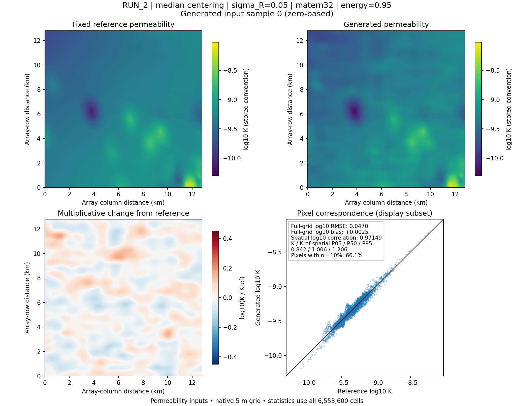
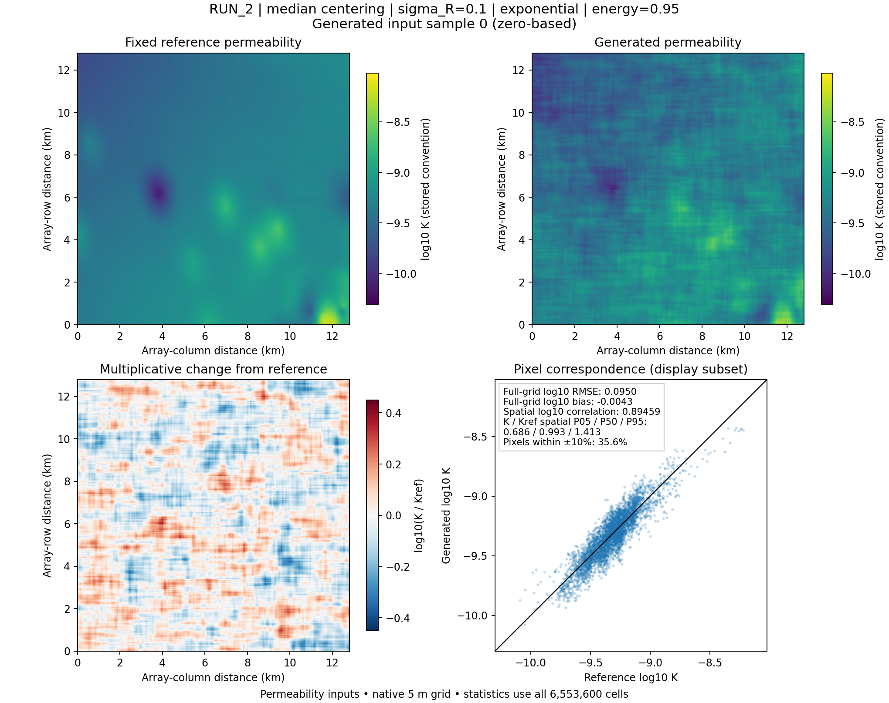

# Generated permeability around a fixed reference

The [pilot plume image](figures/reference_pilot_nominal.png) is the real-K
LGCNN's nominal temperature output. The figures exported here show its
**permeability inputs**, comparing individual generated fields with their
fixed nominal RUN reference. Both views are useful for tracing input changes
through to temperature QoIs.

## Replay an actual subset used by the LGCNN

From the repository root in Git Bash:

```bash
export PYTHONPATH=src
export OPENBLAS_NUM_THREADS=8
export OMP_NUM_THREADS=8
export MKL_NUM_THREADS=8

python -m subsurface_uq.visualization.reference_fields_cli \
  --pilot-output run_output/reference_pilot/temperature \
  --reference-run RUN_2 \
  --sample-indices 0 1 \
  --save-arrays \
  --output-dir run_output/reference_pilot/permeability_previews
```

This exports the first two samples from each of the four primary RUN_2
amplitude/covariance scenarios: eight comparison PNGs. Indices are **zero-based**
and chosen before looking at agreement. `--save-arrays` also saves the eight
native float32 permeability NPY files and their shared nominal reference. Omit
it to keep only PNGs and the JSON manifest. Full ensembles are not retained.

The exporter reads the frozen seed, method and full coordinate-design size
from the completed study. For the paired KL anchor it uses the prefix of the
original largest-dimensional Sobol design. Each regenerated field's raw
float32-array SHA-256 must match the input hash recorded with its original
LGCNN prediction. This check prevents a different Sobol design from being
mistaken for a queried input. The LGCNN does not need to run again.

`--include-kl` adds the two RUN_2 KL sensitivity variants. Alternatively,
`--scenario-ids ID_A ID_B` selects exact IDs from the study's `summary.json`,
including KL variants if explicitly named. Omit `--reference-run` to select
the primary scenarios for all three RUNs, which remain separate references.
Use a fresh output directory for a different selection; existing exports are
not overwritten. Replay requires the original saved input artifacts/reference
companions and a numerically compatible runtime. A hash mismatch is reported,
rather than silently substituting a different input field.

Each scenario directory contains `sample-0000.comparison.png`, etc. Optional
NPYs preserve numerical inputs; PNGs are rendered illustrations. `manifest.json`
records sample indices, artifact/field/image hashes, coordinate dimensions,
reference identity, color limits, retained-array paths and all agreement
statistics. The identical reference/grid shares color scales across the whole
selection. Different RUNs are never averaged into a reference or posterior.

## What agreement means in a PNG

Each PNG shows:

1. The fixed reference's log10 permeability.
2. The generated field on the **same color scale**.
3. The difference `log10(K / Kref)` on a symmetric scale about zero. For
   example, +0.1 means a factor of approximately 1.26 and -0.1 a factor of 0.79.
4. Pixel correspondence against the identity line, with full-grid log10 RMSE,
   log10 bias, spatial correlation, spatial P05/P50/P95 of `K / Kref` and the
   fraction of pixels satisfying `0.90 <= K / Kref <= 1.10`.

The scatter display is subsampled for readability. **All statistics use every
cell of the native field**, and fields are never coarsened for these metrics.
Axes describe array-row/column distances, preserving the pilot's orientation.
Permeability stays in the declared artifact convention; these examples use
the historical training convention, with no extra physical unit conversion.

These are descriptive measures of proximity to one fixed heterogeneous field.
A high correlation can coexist with important local changes. Pixel quantiles
describe this realization's spatial ratios, not geological probabilities or
ensemble confidence intervals. The ±10% fraction is a readable descriptor,
**not an acceptance threshold**: no sample is filtered, clipped or replaced.
The [existing pilot diagnostics](reference_pilot_results.md) separately assess
variograms, spectra and patch descriptors.

Median centering and arithmetic-mean centering retain their input-law meanings.
Neither requires an individual realization to equal the reference, have zero
spatial bias or stay within the ±10% descriptor interval.

## A standalone reference artifact

To preview a new law or reproduce the matrix's MC input diagnostic samples,
specify the sampling design explicitly:

```bash
INPUT_MODEL='run_output/reference_pilot/input_scenarios/SCENARIO_ID/stochastic_input_model.yaml'

python -m subsurface_uq.visualization.reference_fields_cli \
  --input-model "$INPUT_MODEL" \
  --method MC --seed 4901 --n-samples 8 \
  --sample-indices 0 3 7 \
  --output-dir run_output/reference_pilot/standalone_previews
```

The original **full** design size is specified by `--n-samples`; only the
selected indices are exported. Standalone `--method RQMC` requires a power-of-two
design size. `--coordinate-dimension` can reproduce an explicitly shared design
whose dimension exceeds the selected map. Standalone fields are labelled as
generated inputs without a verified LGCNN query. For the completed temperature
pilot, use `--pilot-output` to recover and verify its design automatically.

After installation, `subsurface-uq-plot-reference-fields` is the equivalent
command. The full scenario-family architecture, Gaussian coordinates and
legacy comparison paths are unchanged.

## Executed RUN_2 examples

The command above was executed on the pilot's native 2560 by 2560 arrays.
All eight selected inputs matched their original LGCNN-query hashes. The
[numerical record](reference_field_preview_summary.json) preserves every
sample's metrics, hash and shared color limits; array/image paths in that record
are relative to the local export directory in the command above.

The scenarios use sigma_R in log10 units, median centering, 500/800 m row/column
correlation lengths and 95% covariance energy. Their sampling design is the
original eight-point RQMC design with seed 5901. The exported subset does not
establish ensemble convergence or calibrate the assumed input laws.

| Covariance | sigma_R | Sample index | log10 RMSE | Spatial log10 correlation | Pixels within ±10% |
|---|---:|---:|---:|---:|---:|
| Matérn-3/2 | 0.05 | 0 | 0.04699 | 0.97149 | 66.1% |
| Matérn-3/2 | 0.05 | 1 | 0.04904 | 0.96838 | 62.1% |
| Exponential | 0.05 | 0 | 0.04749 | 0.97068 | 64.0% |
| Exponential | 0.05 | 1 | 0.04919 | 0.96925 | 62.3% |
| Matérn-3/2 | 0.10 | 0 | 0.09398 | 0.89791 | 36.8% |
| Matérn-3/2 | 0.10 | 1 | 0.10284 | 0.87014 | 35.1% |
| Exponential | 0.10 | 0 | 0.09499 | 0.89459 | 35.6% |
| Exponential | 0.10 | 1 | 0.09839 | 0.89115 | 34.8% |

The examples below both use the predetermined sample index zero and the same
fixed RUN_2 reference. The color scales are common across all eight exports.
These two fields illustrate assumed amplitude/covariance choices; their
cross-scenario contrast is not claimed to be a uniformly paired design.




