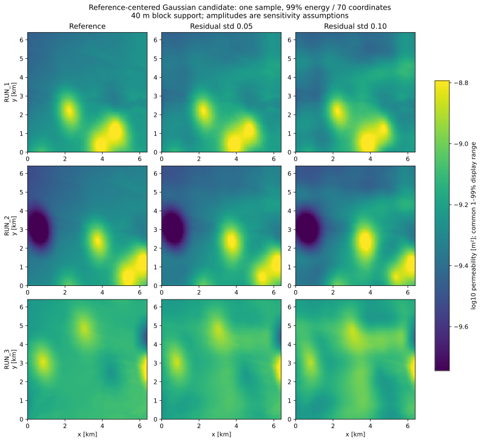

# Reference-field candidate: local-data results

Historical study retained as recorded. The current architecture is now the primary
reference-centered lognormal scenario family; the promotion decision below reflects
the earlier study date. Its scientific limitations and uncalibrated amplitude/covariance
choices remain valid. See [current scenario documentation](reference_field_uncertainty.md).

Study run on 2026-10-05 using the code changes based on commit
`58dd00f6081e912498fc8f8684b8e56d29880c52`. The reproducible workflow and scientific
model are described in [reference_field_uncertainty.md](reference_field_uncertainty.md).
Aggregate outputs are in [reference_field_validation_summary.json](reference_field_validation_summary.json).

## Support and assumptions

The study used actual RUN_1, RUN_2 and RUN_3 inputs from
`dataset_100hp_giant_real_fixP0_0025`, with central half-open raw-grid ROI
`[640:1920,640:1920]`. Geometric 8×8 block means produced 160×160 reference fields
at 40 m cell size, covering 6.4 km × 6.4 km. This support differs from CNN stride
decimation. It is not a full 5 m trained-model validation.

There were 64 realizations for every RUN/amplitude/truncation combination, seed
4901, median centering, no measurement conditioning. Residual standard deviations
0.05 and 0.10 log10 units are sensitivity assumptions. Same seeds across different
dimensions do not give paired common-coordinate realizations; sampled comparisons
include Monte Carlo variability.

Reference-texture variograms favored the radial exponential among three fitted
candidates. The lowest-RMSE supported separable Gaussian-coordinate option was
Matérn-3/2, with y/x scales 1644.26/1607.62 m. Its joint variogram RMSE was
0.00219720 log10-permeability squared. The pooled within-field log10 standard
deviation was 0.150026. These fit results describe the reference texture, not
interpolation-error variance/covariance; the radial model still needs a compatible
finite Gaussian-coordinate implementation before same-law RQMC/PCE comparison.

## Truncation and stochastic dimension

| Requested energy | Actual retained energy | Coordinates | Minimum local variance / full variance | Quadratic PCE terms |
|---:|---:|---:|---:|---:|
| 0.95 | 0.950782 | 28 | 0.791345 | 435 |
| 0.99 | 0.990128 | 70 | 0.947019 | 2556 |
| 0.999 | 0.999004 | 216 | 0.994568 | 23653 |

Mean local variance divided by full variance agrees with the retained trace.
At 95% energy the smallest local variance is still about 21% below the full
covariance variance. A trace target is not a uniform pointwise accuracy bound.
Increasing energy also makes ordinary total-degree response PCE expensive.
No downstream temperature-QoI convergence has been established here.

## Fidelity at 99% energy

Spectral errors are relative L2 differences of ensemble-mean radial/angular
power against the reference. They measure power/texture mismatch; they are not
normalized shape-only errors or an independent realism acceptance test.

| Reference | Residual std | Log10 marginal Wasserstein | Radial power relative L2 | Angular power relative L2 |
|---|---:|---:|---:|---:|
| RUN_1 | 0.05 | 0.011121 | 0.103269 | 0.123267 |
| RUN_2 | 0.05 | 0.010177 | 0.082715 | 0.081339 |
| RUN_3 | 0.05 | 0.017201 | 0.507711 | 0.629008 |
| RUN_1 | 0.10 | 0.034143 | 0.436519 | 0.477255 |
| RUN_2 | 0.10 | 0.030148 | 0.287610 | 0.286340 |
| RUN_3 | 0.10 | 0.047420 | 2.093179 | 2.522496 |

The 0.05 scenario perturbs RUN_1/RUN_2 more mildly than RUN_3. For RUN_3, axis-band
power fraction rises from 0.351686 to 0.423912 at 0.05 and 0.483396 at 0.10. This
does not isolate KL artifacts from covariance choice or added variance, but shows
why marginal similarity alone is insufficient. The larger amplitude clearly
changes spectral power, particularly for the quieter RUN_3 reference. There is
no evidence here for adopting one universal residual amplitude as production.

The displayed fields use 99% energy and the first sample. Color limits share a
pooled 1–99% display range; generated permeability itself is not clipped.

## Parent and measurement evidence

The supplied 20 m parent TIFF matches the recovered checksum
`6d50f2c6f9b96e3136fe77ad177ef4f70cc2d4cfc632f33ff655e59bdcc096ee`.
The strict baseline reconstruction rejects invalid conductivity cells in the
RUN_1/RUN_2 source windows. RUN_3 reconstruction is computable, but the best of
eight raw-array orientations on the matched ROI has RMSE 0.229619 log10 and
correlation 0.146092. This does **not** establish exact numerical parent-to-RUN
reproduction. Source-array preprocessing, extraction conventions or the actual
historical source version remain unresolved; no missing values are filled to
force agreement.

The existing measurement loader filters the workbook to the q/unconfined
population. There are 466 valid parent/measurement pairs. Their log10 hydraulic-
conductivity residual RMSE is 0.311101, bias 0.009455 and standard deviation
0.311291. This is a descriptive parent/measurement audit. It does not prove which
interpolation produced the parent, provide independent held-out validation, or
justify copying 0.311291 into the candidate residual amplitude.

## Decision and unresolved validation

Keep the new law explicitly named `reference-centered-lognormal-candidate`, with
the old measurement-kriging default retained. It supplies a consistent finite
Gaussian input representation and realistic nominal reference scenarios, but
its uncertainty amplitude/covariance is not identified by these data alone.

Required before promotion: resolve numerical parent-to-RUN provenance; compare
radial/rotated residual alternatives under the same finite coordinate contract;
study interpolation and measurement support/error separately; use independent
spatial-block validation where dependence permits it; evaluate full-resolution
training support and temperature-QoI convergence across amplitude/truncation.

Local behavioral checks cover KL/conditioning moments, serialization and RQ1,
the actual input HDF5 layout, Gaussian/Hermite response recovery, spectrum
normalization and CLI artifact generation. CI uses a clean install with the
complete test/Perlin dependency set; its branch status is reported separately.
