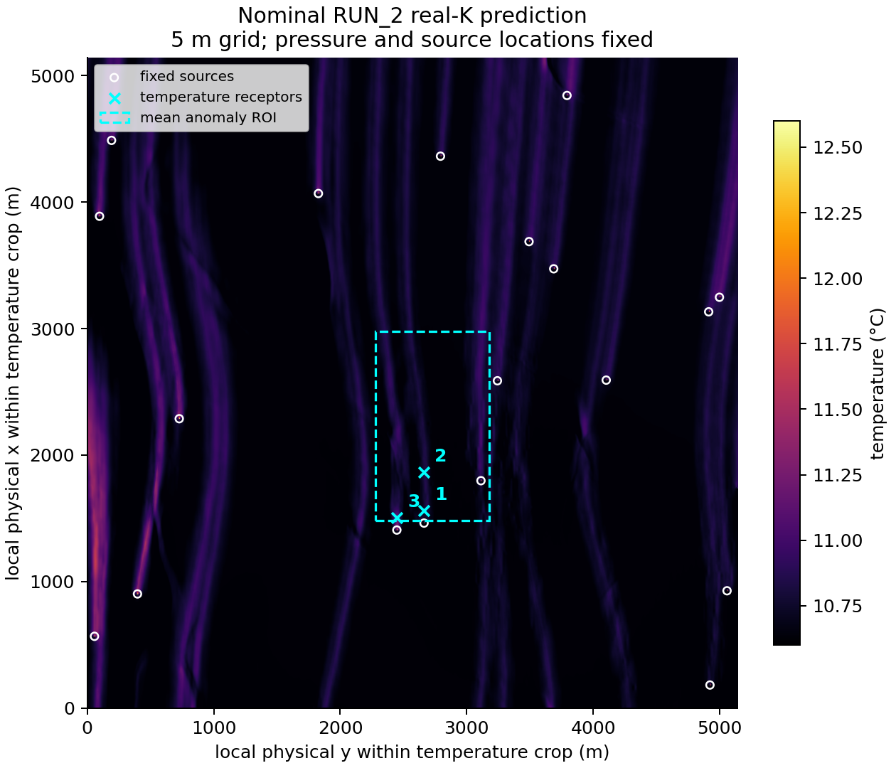
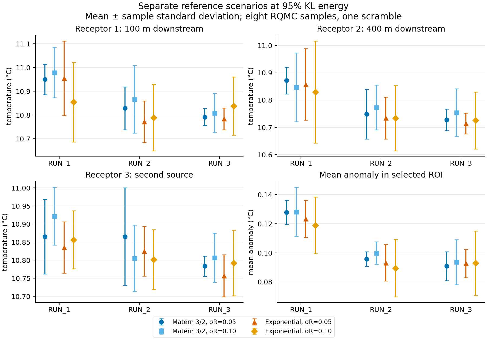

# Reduced reference-pilot results

The reduced study completed on 2026-10-06: **12 primary scenarios plus two KL variants, eight samples each, 112 finite real-K temperature predictions**. No scenario weights, pooled posterior or sample rejection were used. The full 96-scenario matrix was not executed.

Computational base: `be72f08e25b1078fd7cb406de9f3dab24b678502`. The new preparation and pilot scripts were frozen by SHA-256 in the run context. [Design and Git Bash replay commands](reference_pilot.md) and [portable numerical record](reference_pilot_summary.json) provide the detailed setup. Full local manifests retain raw/model/artifact hashes and the exact resolved paths.

## Native data and fixed model setup

RUN_1/2/3 references are actual 2560×2560 arrays at 5 m. RUN_1 uses its original input HDF5; RUN_2/3 use initial-time simulation outputs. Fixed pressure and 100 source locations come from RUN_2, with background 10.6 °C. Only permeability varies. Both real-K checkpoints load strictly; preparation agrees exactly with the upstream normalizer and persisted physical-channel recovery passes.

The upstream checkout base is `353b143a3a0f54b9845df5d54615823550474a07`, with pre-existing training-visualization and comment changes. Every Python source is fingerprinted; the temperature run uses the existing bounded streamline factory. The native network chain is 2560→1796→1028, and receptor/ROI coordinates account for the total crop of 766 cells per side.

## Input and representation sensitivity

At 95% energy the same native geometry needs **607 Matérn-3/2 modes versus 9316 exponential modes**. For the RUN_2, sigma_R=0.05 Matérn anchor, 0.95/0.99/0.999 retain 607/1567/5049 modes. Their mean retained log10 variances are 0.00237517/0.00247502/0.00249750; local retained variance is spatially nonuniform.

Doubling sigma_R from 0.05 to 0.10 increases marginal Wasserstein deviations approximately 3.06–3.66 times and directional variogram mismatch approximately four times. RUN_3 has the strongest relative spectral changes. These describe total-field changes from each nominal reference on matched 40 m diagnostic support; low reference power can amplify relative errors. They do not estimate residual calibration or certify 5 m training compatibility.

## Separate temperature scenarios

Values below are mean ± sample standard deviation in °C from one eight-point scrambled-Sobol design. The last column is the ROI mean anomaly relative to 10.6 °C. The scenarios use median centering, ell_y=500 m along rows and ell_x=800 m along columns, and 95% energy. The exact training inventory is unverified. Scenario contrasts are not uniformly paired; the KL anchor uses a higher-dimensional shared design.

| RUN | sigma_R | Covariance | T1 | T2 | T3 | ROI anomaly |
|---|---:|---|---:|---:|---:|---:|
| RUN_1 | 0.05 | exponential | 10.9547 ± 0.1571 | 10.8577 ± 0.1312 | 10.8354 ± 0.0707 | 0.1233 ± 0.0128 |
| RUN_1 | 0.05 | matern32 | 10.9498 ± 0.0646 | 10.8719 ± 0.0489 | 10.8653 ± 0.1032 | 0.1278 ± 0.0083 |
| RUN_1 | 0.10 | exponential | 10.8545 ± 0.1676 | 10.8296 ± 0.1871 | 10.8565 ± 0.0805 | 0.1189 ± 0.0195 |
| RUN_1 | 0.10 | matern32 | 10.9790 ± 0.1066 | 10.8471 ± 0.1262 | 10.9222 ± 0.0798 | 0.1282 ± 0.0169 |
| RUN_2 | 0.05 | exponential | 10.7716 ± 0.0877 | 10.7342 ± 0.0768 | 10.8250 ± 0.0686 | 0.0932 ± 0.0126 |
| RUN_2 | 0.05 | matern32 | 10.8283 ± 0.0906 | 10.7481 ± 0.0910 | 10.8653 ± 0.1347 | 0.0958 ± 0.0050 |
| RUN_2 | 0.10 | exponential | 10.7891 ± 0.1397 | 10.7338 ± 0.1195 | 10.8014 ± 0.0828 | 0.0895 ± 0.0198 |
| RUN_2 | 0.10 | matern32 | 10.8666 ± 0.1428 | 10.7732 ± 0.0820 | 10.8056 ± 0.0920 | 0.0998 ± 0.0078 |
| RUN_3 | 0.05 | exponential | 10.7838 ± 0.0457 | 10.7140 ± 0.0381 | 10.7566 ± 0.0583 | 0.0927 ± 0.0098 |
| RUN_3 | 0.05 | matern32 | 10.7916 ± 0.0359 | 10.7276 ± 0.0393 | 10.7835 ± 0.0278 | 0.0908 ± 0.0099 |
| RUN_3 | 0.10 | exponential | 10.8377 ± 0.1223 | 10.7257 ± 0.1045 | 10.7922 ± 0.0909 | 0.0929 ± 0.0221 |
| RUN_3 | 0.10 | matern32 | 10.8084 ± 0.0824 | 10.7544 ± 0.0867 | 10.8072 ± 0.0681 | 0.0936 ± 0.0155 |

The maximum absolute mean change between four- and eight-point prefixes is 0.0704 °C for a receptor and 0.0095 °C for the ROI. These budgets and one scramble do not establish integration convergence, confidence intervals or reliable 5%/95% tails.

## Paired KL temperature comparison

All three truncations use the same Gaussian coordinates for shared eigenmodes. RMS changes are relative to the 5049-mode map, which is a representation comparison and not truth.

| Energy | Modes | T1 paired RMS | T2 paired RMS | T3 paired RMS | ROI paired RMS |
|---:|---:|---:|---:|---:|---:|
| 0.95 | 607 | 0.02949 | 0.11955 | 0.10030 | 0.00290 |
| 0.99 | 1567 | 0.05187 | 0.02755 | 0.04063 | 0.00396 |
| 0.999 | 5049 | 0.00000 | 0.00000 | 0.00000 | 0.00000 |

The 95% map changes receptor 2 by about **0.120 °C RMS** and receptor 3 by 0.100 °C, while the ROI changes by 0.00290 °C RMS. Increasing energy does not uniformly decrease all observed differences: receptor 1 and the ROI have larger paired RMS at 99% than at 95%. Eight points do not support a monotone convergence claim. A retained-energy criterion alone is insufficient for choosing the representation.

## Support checks and full-matrix feasibility

Across these temperature inputs, the largest fraction beyond stored permeability normalization min/max is **0.16653% for CNN1** and **0.00000% for CNN3's cropped input**. Every sample was evaluated. The supplied-reference patch envelopes are also compared on the published 1280-cell/stride-8 lattice, with feature decimation only for descriptors. Neither check certifies membership in the original training distribution.

The exponential full-grid preflight yields:

| Energy | Coordinates | Current Sobol path | Dense degree-2 Hermite terms |
|---:|---:|---|---:|
| 0.95 | 9,316 | Supported | 43,407,903 |
| 0.99 | 71,290 | Exceeds limit | 2,541,238,986 |
| 0.999 | 413,094 | Exceeds limit | 85,323,946,060 |

The installed SciPy Sobol limit is 21,201. Gaussian MC remains valid, but the two larger exponential choices cannot execute with the present Sobol implementation, and dense response PCE is impractical. Fixed 20 modes retain only 14.46% exponential covariance energy here, so a small coordinate count is also a materially different representation.

**Keep the full matrix deferred.** First repeat the paired anchor at larger budgets and independent scrambles, agree QoI tolerances and resolve the original prepared training inventory. Select dimensions or integration/approximation methods that can handle the assumed laws. This is a computational/scientific study decision; it does not identify a calibrated sigma, covariance or scenario probability.

## Verification and resource record

All 14 saved 8×4 QoI arrays reproduce their reported moments, and all 112 cached-result checksums verify. Summed elapsed inference time on CPU was 14.89 minutes, with median 7.93 seconds per prediction (batch 1, eight CPU threads). No full generated ensembles were retained. These timings exclude preparation, eigensystems and diagnostics.

The 27 selected scenario/matrix/RQ1 regression tests passed locally. [CI for the computational base](https://github.com/TorbenAdelhelm/Masterthesis/actions/runs/37456528079) passed on Python 3.11 and 3.12. Publication is configured to trigger the same branch CI; the run identifier and result are recorded in the task completion report. No architecture source files or CI settings were changed for this study.
